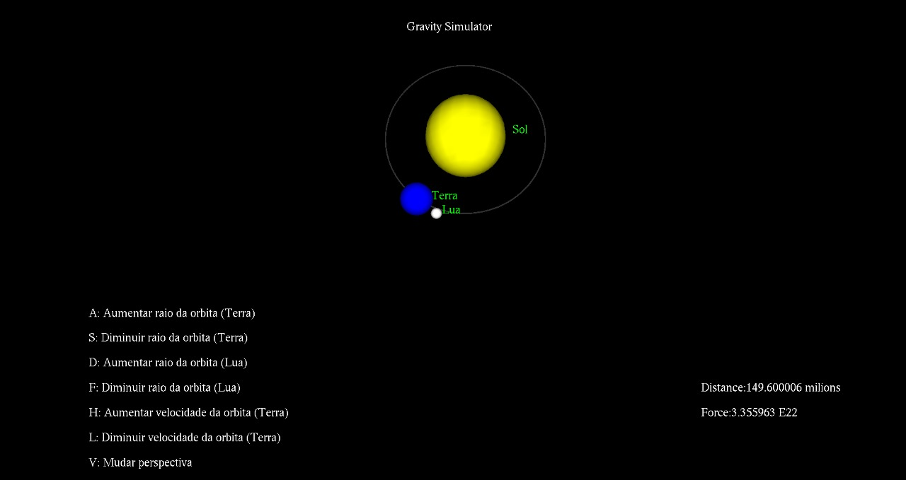
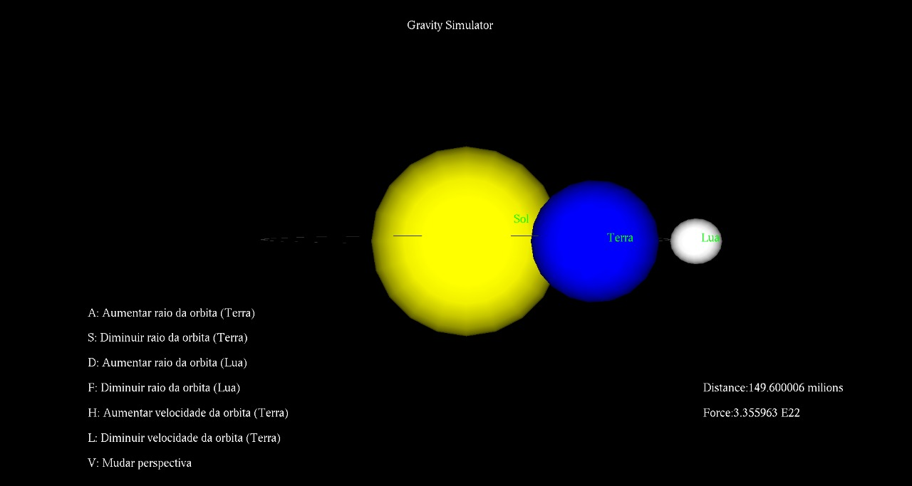

# Projeto sobre força gravitacional

O trabalho descrito consiste em três esferas representando o Sol, o planeta Terra e a Lua. A disposição dos corpos será com o sol no centro da tela, com a Terra girando em torno dele a uma distância “D”, e a lua girando em torno da Terra a uma distância “d”. Durante a execução do programa é possível observar a relação entre a força gravitacional e a distância D, usando a Lei da Gravitação Geral de Newton.

